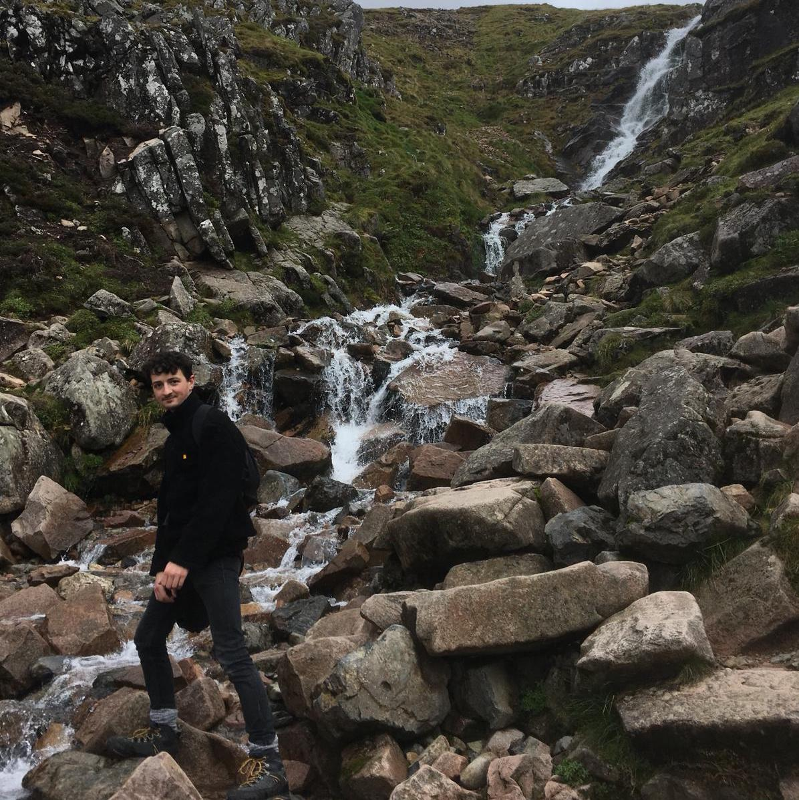
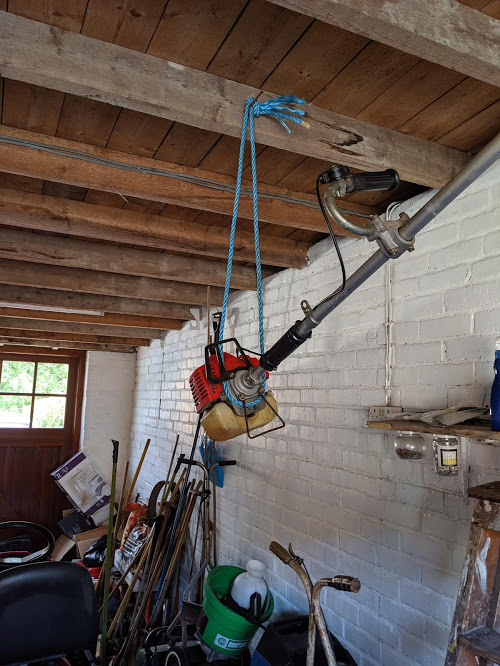
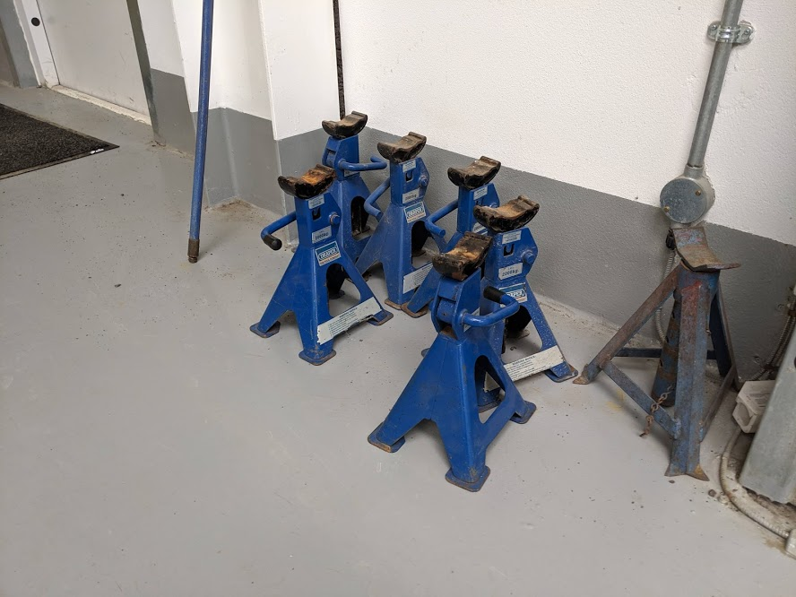
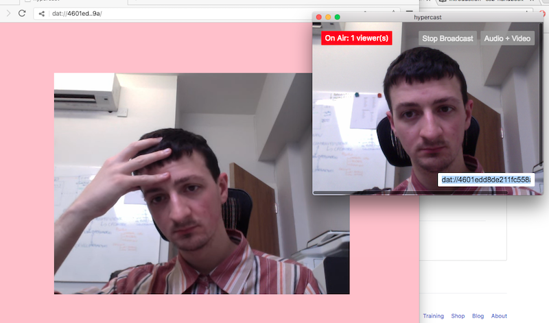
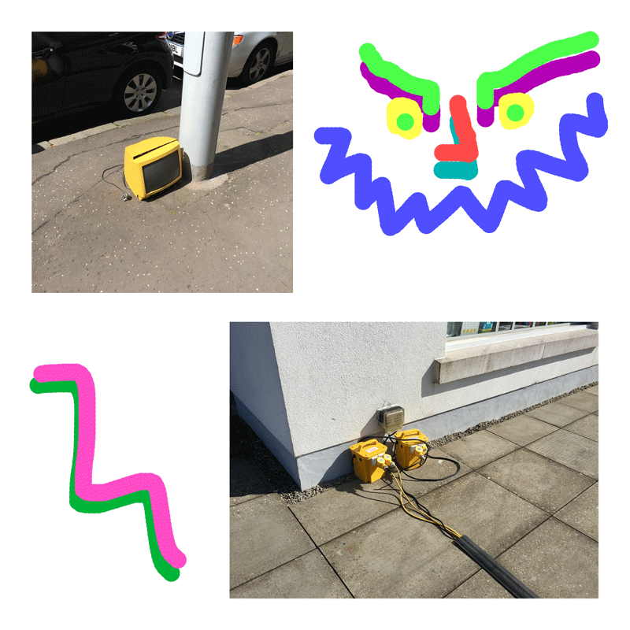

# niall morris
## [music](#music), [software](#software), [radio](#radio), [etc](#etc)...

hello and thank u for visiting my web page 🤗

e-mail: [niall@shamgate.co](mailto:niall@shamgate.co)

## music
#### Banana Oil _(2017-now)_
chunky musical trio w/ Laurie Pitt (Golden Teacher, Modern Institute, Thoth) and [Joe Howe][joe] (Joe Howe, Ben Butler & Mousepad, Gay Against You). sounds like jazz(/fusion), prog, skronk etc

![photo by Derek Brennan][BOs]

+ **Ultamate Mix**: 5 track CD / banana scented portable Heraldic Banner. Entirely self-recorded, released etc. Hand delivered where possible (Sep 2020).
	+ [listen](https://bananaoil.bandcamp.com/album/ultamate-mix) on bandcamp
	+ purchase / read write up at [monorail music](https://www.monorailmusic.com/album/4ccfca0b-f102-11ea-87da-06dc08905bb8/Ultamate_Mix.html)
+ we were the "house band" for the sorely missed [Gloss Canteen](https://www.instagram.com/glosscanteen/) at Civic House from late 2019
  + amongst other things, this meant playing "smooth jazz / jazz-funk" at  popular Friday dinner events. We would play for about 3+ hours as the soundtrack to an *extremely* delicious meal.
+ we put together a ceilidh set 🏴󠁧󠁢󠁳󠁣󠁴󠁿 and played a couple of very speical events for friends in 2019.
+ live recording included on a compilation by Glasgow label Huntley + Palmers - [free download](https://huntleyspalmers.bandcamp.com/album/h-p-clyde-built-5-0-compilation-free) (Jun 2019)
+ we were very kindly asked to perform as a backing band for artist [jessica higgins](http://jessicasusanhiggins.info/) for her performance at [Outskirts festival](https://www.platform-online.co.uk/whats-on/event/550) in Easterhouse. We also performed a "normal" set at this event (Apr 2019).
+ cassette released October 2017 on [winning sperm party][wsp].
  + I painted and hand-sewed 100 cassette covers from hessian sacks that had previously been worn as stage costumes. [Buy one / download here][bo buy].
  + [listen][long man] to something
+ press
    + [The Quietus][bo-quietus] (Oct 2017)
    + [RoughSmooth mag](https://roughsmoothmag.com/2017/12/24/the-1o-best-up-and-coming-glasgow-bands-you-really-need-to-go-see-in-2018/) (Dec 2017)

#### Lylo _(2016-2019)_
i played synthesiser and contributed to recording and production of this self-produced glasgow 5 piece band

![photo by Neelam Khan][lylo]

+ synth + contributions to recording + production of post-album single *Nothin' New* - [listen](https://www.theskinny.co.uk/music/new-music/lylo-nothin-new-track-premiere) (Nov 2018)
+ i played synthesiser on the album *Post Era*, released Jan 2018 on [El Rancho Records][el rancho fb].
  + read / listen @ [Clash Music][yeah boy].
+ [soundcloud][lylo soundcloud] / [facebook][lylo facebook]

#### Robert Sotelo _(2017-2017)_
good + thoughtful psych pop from London (now Glasgow-based). i played bass in the live *Robert Sotelo Group*!

![cusp album cover][cusp]

+ an album called **Cusp** came out on [Upset The Rhythm][upsettherhythm] in September 2017. i didn't play on it so it's ok for me to say *"it's good and i like it"*
  + read some [press][cusp press]
  + [buy][cusp buy] a record

#### Martha Ffion _(2015-2017)_
I played bass for my nice friend [Martha Ffion][martha] at lots of live dates, an EP and an album:

![photo by Eoin Carey][mf]

+ **Trip** EP: released October 2016. [review][trip review] / [buy][trip buy]
+ **Sunday Best** album on [Turnstile Music][turnstile] 👀
  + read / listen @ [Gold Flake Paint](https://www.goldflakepaint.co.uk/new-music-martha-ffion-we-make-do/)

#### Sham Gate _(2014-2019)_
a solo project built around analogue synthesisers and singing

![thank u][sham gate]

+ gonna end soon but release 1 last tape before it's all over
+ music + visual loop for [Nowhere To Be Found][ntbf] in October 2017
+ included on compilation by [Huntley & Palmers](https://huntleyspalmers.bandcamp.com/album/h-p-clyde-built-20-compilation-free) in Nov. 2016
+ tape contribution to [That's Life!][thats life] exhibition at Good Press gallery in Apr 2016
  + listen [here][sorry]
+ song included on *I Could Be Your Unicorn* cassette compilation on [Number4Door][n4d] in association w/ GSA Queer Society for their launch in Aug 2014
+ this all started w a piece called *Analog Synthesis Approximations of the Dialogue between Structuralism and Post-Structuralism in Architecture Considered in Relation to Foucault's Principles to the Art of Living Counter to All Forms of Fascism* which was performed at Glasgow City Halls in March 2014

#### Come Outside _(2018-now)_
heart on sleeve emo band w/ [Chrissy Barnacle][chrissy] and Kevin Frew (Halfrican, North American War).

![photo by mama frew][kevin]

+ played first shows early 2019 💀 🤗
+ did some recording on kenmure st that will manifest somehow in the coming weeks / months

---

## software
I'm interested in creative applications of software, making software (+ development) accessible, and interesting ways of thinking about web technology.
+ I teach software skills at *a Glasgow-based coding bootcamp* since summer 2019. I work with Ruby, JavaScript, Vue, Node, React, Java etc.
+ Before this, I worked for 1.5 years experience as a full stack developer with with C#, .NET, TypeScript & Angular.
+ [MSc Software Development][uni] masters programme at University of Glasgow. I got an **A** average grade. Graduated November 2017.

Selected Projects:
+ [cococnut gallery](https://github.com/kingdomlevel/coconut_gallery): web app that requests camera access, uploads a photo, and prompts the user to draw other photos using HTML canvas. Ruby on Rails w storage on AWS S3 (Summer 2020).
+ [Bandcamp BLM Bot](https://github.com/kingdomlevel/bandcamp-blm-bot): during the coronavirus pandemic, bandcamp started to waive their fees on the first Friday of every month in order to support musicians. I made a [twitter bot](https://twitter.com/bandcampBLMbot) (in Ruby) that re-tweeted musicians, labels etc that are donating their profits to Black Lives Matter, bail funds, support charities etc (June 2020).
+ [twentytwenty](https://github.com/kingdomlevel/twentytwenty): simple presentation viewer built early 2020. I made this to try out [Strapi CMS](https://strapi.io/) and learn React hooks.
+ [source room](https://github.com/kingdomlevel/source-room): functional website for a fake art gallery. Full stack web app w/ **no javascript 😲!!!**
+ [Automatic Tools for Populating Graph Representations of Multimedia Catalogues][summer proj]: university summer project back in 2017.

feel free to [peep my github][github] 🤷‍

---

## radio

![me and louise doing feka @ subcity :)][feka photo]

+ i did a [show on Clyde Built Radio](https://soundcloud.com/clydebuiltradio/niall-morris-28-6-20) in June 2020 - a highlight for me was getting to play out an old demo tape my dad recorded in 1982 ☺️
+ i read some text written by [Joe Howe][joe] for his contribution to Radiophrenia 2019 - [listen](https://soundcloud.com/joooehooowe/joe-howe-the-dirty-table-pt-1?fbclid=IwAR0L8JudIG0TbNXLzonqrIaVOJtp5L60kL8ui1leNs4FEFO4GABP7lbT0N8)
+ made some shorties for [Radiophrenia 2017][radiophrenia] in collab w/ [Rachel Woodside][rachel]. built around story telling and voice-modelling synthesis.
+ i recorded and edited [Radio Benjamin: Glasgow Constellations][benjamin], broadcast at pop-up experimental radio station Radiophrenia in 2015
+ i was the manager for glasgow institution [Subcity Radio][subcity] from 2013-2014
    + notably, undertook a significant visual identity overhaul, revised scheduling and team structure which proved successful
    + got lots and lots more contributors, some good press, and increased listeners
+ i used to do a radio show w/ my buddy [louwheeez][louise] called [Feka][feka]
  + an especially cool episode was [this exclusive thing][central heating] by the Prince Of Caps Lock WANDA GROUP
+ i helped establish and occasionally produce the [El Rancho][el rancho radio] radio show on subcity.

---

## etc
I have a degree **MA(Hons) Music** and I got a **2:1**. I graduated in 2014.

i like [are.na][are.na]

i sometimes [tweet][twitter]

e-mail: [niall@shamgate.co](mailto:niall@shamgate.co)

#### miscellaneous things i have done

##### 2019
+ release of David Thomas Broughton's *Live 2017 (Autumn​/​Winter Tour)* cassette - I played bass on one song ([listen](https://davidthomasbroughton.bandcamp.com/track/silent-arrow-live-in-glasgow)) (Jun 2019)

##### 2018
+ went to Austin, Texas to perform at SXSW festval and had _a blast_!
+ made a ~40 min video / performance w/ Banana Oil for The Old Hairdresser's GI festival programme (*documentation incoming*)

##### 2017
+ contributed to [N.E.E.T.](https://akashicrecords1.bandcamp.com/album/n-e-e-t-not-in-education-employment-or-training) cassette on Glasgow label *Akashic Records*. I'm on 3 recordings on the tape, from courses completed at [Green Door Studio](http://www.greendoorstudio.co.uk/). tape released **August 2017**.
+ Worked for [Dear Green](https://www.deargreencoffee.com) Coffee Roasters as a barista / brand rep at lots of events over summer.

##### 2016
+ hosted a workshop about making electronic music for new students at Glasgow School of Art (part of Fresher's week).
+ exhibited photos, wrote a substantial amount of copy and designed a poster for *Not Shy* exhibition at The Art School in August 2016

##### 2015
+ went to Tafi Atome, Ghana for a month (November)  with Green Door Studio on the [“Music of the Volta Region” Study Tour](http://taficulturalinstitute.weebly.com/study-tour.html).
  + Learned lots of drumming, dancing and singing in the styles of Borborbor, Agbadza, and Adeʋu
  + visited other parts of Ghana + had a nice time 🏝
+ Completed *Sonic Youths* music production course at Green Door Studio, and used the allocated studio time to record an EP for my band *Fields of Mould*. This happened in September
+ Presented and interviewed a lot of people for a [documentary](https://www.youtube.com/watch?v=6o1yNX_Ky-A) about community radio station Subcity Radio back in July.
+ Contributed to Glasgow Open House Festival in the form of [Psychecon: Quest for the Golden Egg](http://2015.glasgowopenhousearts.co.uk/programme/psychecon-quest-for-the-golden-egg-festival-companion/); a "festival companion" web adventure with significant audio component. This was back in May 2015.
+ co-direction and concept for two music videos for the band Poor Things in March. ([1](http://podcart.co/poor-things-friends/) / [2](http://www.tenementtv.com/news/premiere-poor-things-sugar/))

##### 2014
+ contributed to [You Are Here: John Cage Songbooks](https://www.facebook.com/events/299132326961742/), an audiovisual installation and performance of John Cage pieces at Scotland Street School Museum, Glasgow in October.
+ photo / digital print included in I Could Be Your Unicorn, an exhibition of self portraits by artists who identify as queer, at The Art School in Glasgow in August.
+ multiple sound performances at  Glasgow Royal Concert Hall as part of the [New Music Biennial](http://prsfoundation.com/partnerships/flagship-programmes/new-music-biennial/new-music-biennial-2014/) showcase weekend in August
+ did a weird live performance about radio called *Human Radio* for my Sonic Arts undergrad and got an **A2** haha
+ collaborative audiovisual work with visual artist Rachel Sharpe featured at Niteflights, part of Glasgow Short Film Festival programme in February.

##### 2013
+ Commissioned to perform sound piece *Power Relaxation Quest* at Glasgow City Halls (part of Glasgow Life's *sound lab* programme) in October.
+ Took part in field recording excursion to Kyle of Lochalsh / Skye with *Touch* recording artists Jana Winderen and Mike Harding in September.
+ Selected photos exhibited at Reprographic, a Glasgow based pop-up exhibition, in August.
+ Contributed towards [Mechanical Wave](http://www.tramway.org/events/Pages/Mechanical-Wave.aspx), an experimental sound performance that was part of Tramway's [Rip It Up](http://www.tramway.org/blog/Pages/Tramway-Jan---March-2013-season-now-live-.aspx) season, in February.

<!-- blues collage -->

<link rel="stylesheet" type="text/css" media="all" href="markdown_styles.css" />

    
    
    

        <svg>
            <path d="M10,10 L50,100 L90,50"></path>
        </svg>
    

<!-- mascot -->
<link rel="stylesheet" type="text/css" media="all" href="./mascot.css">
<section>

  

      
general annual website review

  

</section>

<!-- hypercast -->

<!-- yellow smile collage -->

[//]: # (links)
[github]: https://github.com/kingdomlevel
[uni]: https://www.gla.ac.uk/postgraduate/taught/softwaredevelopment/
[summer proj]: https://github.com/kingdomlevel/AutomaticAudioCataloguing

[joe]: http://joe-howe.com/
[wsp]: http://winningspermparty.com/
[long man]: https://soundcloud.com/winningspermparty/02-banana-oil-long-man
[bo-quietus]: http://thequietus.com/articles/23443-jazz-column-oct-banana-oil-john-chantler-steve-noble-seymour-wright-vijay-iyer-sextet
[bo buy]: https://winningspermparty.com/

[lylo soundcloud]: https://soundcloud.com/lyloband
[lylo facebook]: https://www.facebook.com/lyloband/

[el rancho fb]: https://www.facebook.com/elranchorecords/
[yeah boy]: http://clashmusic.com/news/premiere-lylo-yeah-boy

[martha]: https://en-gb.facebook.com/marthaffionmckay/
[turnstile]: http://www.turnstilemusic.net/
[trip review]: https://www.goldflakepaint.co.uk/review-martha-ffion-trip-ep/
[trip buy]:  https://www.roughtrade.com/gb/music/trip

[upsettherhythm]: http://www.upsettherhythm.co.uk/sotelo.shtml
[cusp press]: https://noisey.vice.com/en_au/article/bjxvyz/robert-sotelo-is-a-social-worker-who-writes-beguiling-psych-pop
[cusp buy]: http://upsettherhythm.bigcartel.com/product/robert-sotelo-cusp-pre-order

[ntbf]: https://www.nowheretobefound.net/ntbf6
[thats life]: http://goodpressgallery.co.uk/thats-life/
[sorry]: https://shamgate.bandcamp.com/album/sorry
[n4d]: http://number4door.info/

[chrissy]: https://en-gb.facebook.com/chrissy.barnacle/

[radiophrenia]: http://radiophrenia.scot/
[rachel]: http://www.rachelwoodside.com/
[benjamin]: http://2015.radiophrenia.scot/radio-benjamin-glasgow-constellations/
[subcity]: https://subcity.org
[louise]: https://louwheeez.wordpress.com/
[feka]: https://subcity.org/shows/feka
[el rancho radio]: https://www.subcity.org/shows/elrancho/
[central heating]: https://www.subcity.org/shows/feka/d2794/

[are.na]: https://www.are.na/niall-morris
[twitter]: https://twitter.com/kingdomlevel

[//]: # (images)
[BOs]: images/BOs.jpg
[lylo]: images/lylo.jpg
[mf]: images/mf.jpg
[cusp]: images/cusp.jpg
[sham gate]: images/shamgate.gif
[kevin]: images/jealousnerds.jpg
[feka photo]: images/feka.jpg
